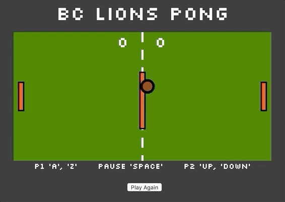
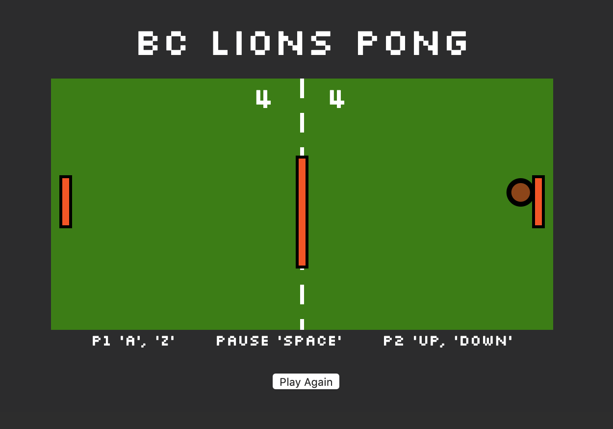

# Pong Game

A playable and unique pong game using SVGs:

1. Board
2. Paddles x3
3. Ball
   Board designed at 512 x 256 with scoring based on the ball element passing the threshhold "0" for player 2 and "board width" for player 1.
   (see "Stretch Goals" for unique properties of Ball and Paddles)

##Stretch Goals
In-Game:

1. On New Game Start, you are prompted to confirm you are "ready to play Pong!" before playing (any key entry that is not 'null' will begin a game).
2. Added a centercourt "paddle" as an obstruction to make the ball bounceback on both sides.
3. The ball speeds up after every successful hit by .5, increasing rally difficulty.
4. The paddls (player1, player2) shrink slightly on each successful hit, further increasing the difficulty of a rally.
5. On pause, the game plays the Super Mario Bros. pause jingle.
6. At a score of 10, the "Player Wins" text appears, specifically on the winner's side of the court.
7. I modelled the colors after a brown football, green field and the official orange of the BC Lions.

## Setup

**Install dependencies:**

`> npm i`

**Run locally with Webpack Dev Server:**

`> npm start`

**Build for production:**

`> npm run build`

## Keys

**Player 1:**

- a: up
- z: down
  Paddle speed set to 35, in this project we did not learn "smooth scrolling" so they are a bit jumpy but need to be able to move quickly.

**Player 2:**

- ▲ : up
- ▼: down
  Paddle speed set to 35, in this project we did not learn "smooth scrolling" so they are a bit jumpy but need to be able to move quickly.

